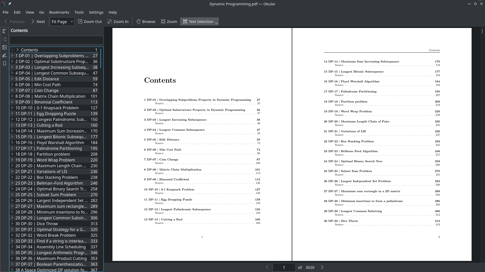

# Geeks for Geeks PDFs

PDF versions of Geeks for Geeks articles. Compiled into book form.

Big shout out to [@gnijuohz](https://github.com/gnijuohz) for his [awesome work](https://github.com/gnijuohz/geeksforgeeks-as-books/).

The only thing I wasn't satisfied with was that the articles in the PDFs were listed in random order, which just felt odd, so I did a bit of manual work by first storing the links in JSON, sorting them by hand, fixing a few title issues and then fine tuning the PDF output generated by customising the pandoc latex template. 

The results are super neat.

Download them on the [releases](https://github.com/dufferzafar/geeks-pdf/releases/) page.

## Running the code

1. First, find out a "topic url" for what you want to download. Eg:

    * `https://www.geeksforgeeks.org/tag/samsung/`
    * `https://www.geeksforgeeks.org/category/dynamic-programming/`

2. Create a JSON containing links of all posts on that topic

    * `py3.6 list_links.py https://www.geeksforgeeks.org/tag/samsung/`

    * This JSON can now be edited by hand, to remove some links, re-order them etc.

3. Now fetch the actual posts

    * `py3.6 download_html.py JSON/Samsung.json`

4. Finally, convert the HTML to a PDF using Pandoc

    * `py3.6 html_to_pdf.py HTML/Samsung.html`

Things will work only if you're really lucky. This project has taught me how fragile my HTML to PDF pipeline really is. There's just too many things that can go wrong.

## What could go wrong

* The PDF engine that pandoc calls may err!
    - In which case, you should convert the html to tex
    - Then run pandoc on the tex file in verbose mode
    - and manually fix the tex file
